# 한국 프로야구 선수 정보 AI 챗봇 (keypl)

> KBO 신규 팬이 경기 중 궁금한 선수 정보를 빠르게 확인할 수 있도록  
> 선수 프로필/성적/뉴스를 제공하고, OpenAI 기반 요약까지 지원하는 챗봇 프로젝트입니다.

## 실행 데모 영상
본 프로젝트는 Streamlit 기반으로 구현된 한국 프로야구 선수 정보 AI 챗봇입니다.  
선수 프로필 조회, 시즌 성적 분석, AI 요약, 뉴스 및 구단 SNS 조회 기능을 포함합니다.

아래 영상은 로컬 환경에서 실제 실행되는 화면을 시연한 데모 영상입니다.  
(YouTube 일부공개 링크로, 링크를 통해서만 시청 가능합니다.)

▶️ https://www.youtube.com/watch?v=2erc6YpezZ4

## 프로젝트 개요
최근 KBO 관중 증가로 신규 팬 유입이 늘면서, 경기 중 생소한 선수가 출전할 때  
선수 정보를 빠르게 확인하기 어려운 문제가 있습니다.  
본 프로젝트는 선수 정보를 '게임 캐릭터 능력치'처럼 직관적으로 조회할 수 있는 AI 챗봇을 구현했습니다.

- 과제명: 한국 프로야구 선수 정보 AI 챗봇
- 팀명: keypl
- 참여 인원: 3명
- 역할: 데이터 수집/정제, 질의 처리 로직 구현, 크롤링 연동,  OpenAI 기반 응답 생성 및 Streamlit UI 구성

## 주요 기능
- 선수 기본 정보 조회 (이름, 소속, 포지션, 등번호 등)
- 시즌 성적 / 최근 경기 / 세부 지표 조회
- OpenAI 기반 성적 요약 (현재 성과, 특징, 전망을 자연어로 설명)
- 뉴스/SNS 정보 제공 (조회 시점 기준 최신 정보)
- 실사용 상황 질의 처리
  - 팀 + 등번호 검색 (예: “LG 6번 누구야?”)
  - 동명이인 자동 분류
  - 입력 오류/오타 보정

## 데이터/구조 설계
- 정적 정보(선수 프로필, 구단 SNS 등): DB/파일 형태로 저장하여 빠르게 조회
- 변동 정보(시즌 성적, 최근 경기, 뉴스/기사 등): 조회 시 실시간 크롤링으로 최신성 확보  
→ 저장공간을 줄이면서도 정확성과 실시간성을 확보하는 구조로 설계했습니다.

## 기술 스택
- Python
- pandas, numpy
- requests (크롤링/데이터 요청)
- OpenAI API (성적 요약)
- Streamlit (UI / 인터페이스)

## 실행 방법 (Local)
pip install -r requirements.txt
streamlit run src/chatbot_ui_chat.py

## 실행 결과

실행 화면 전체 보기

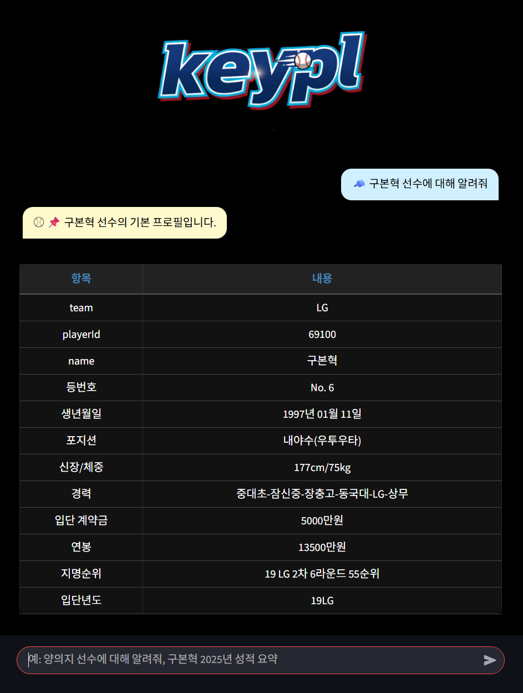
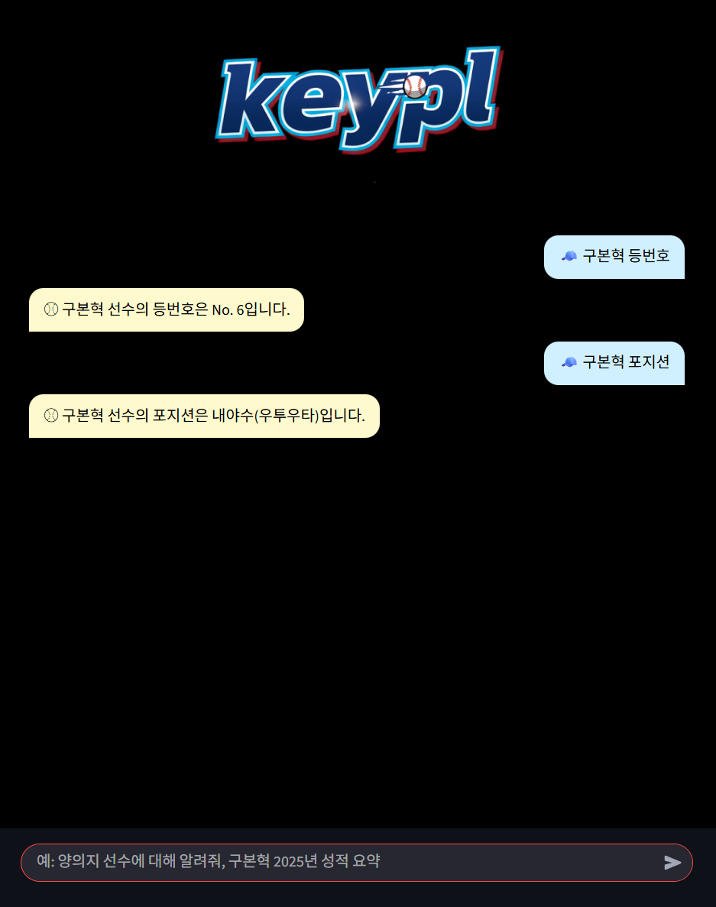

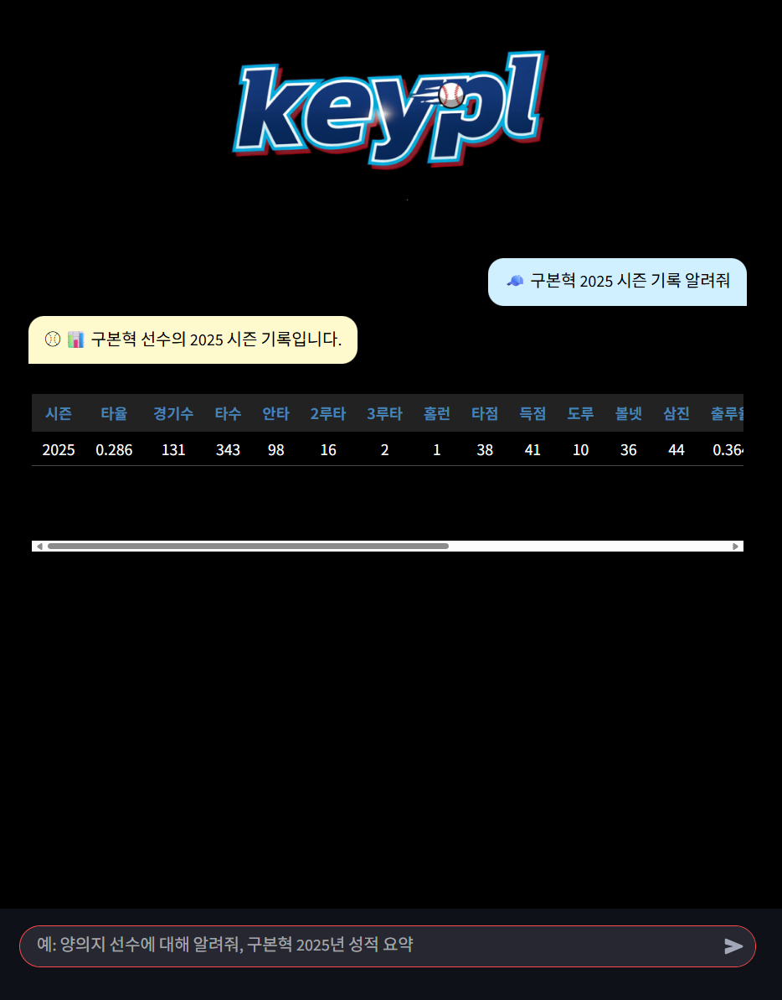
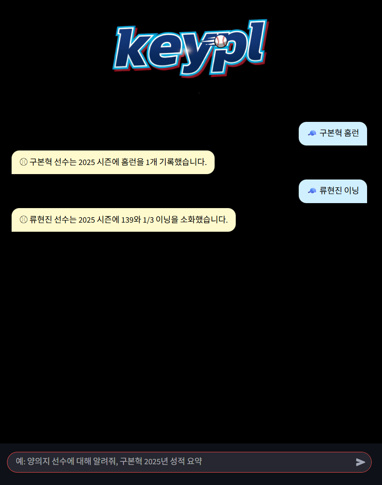
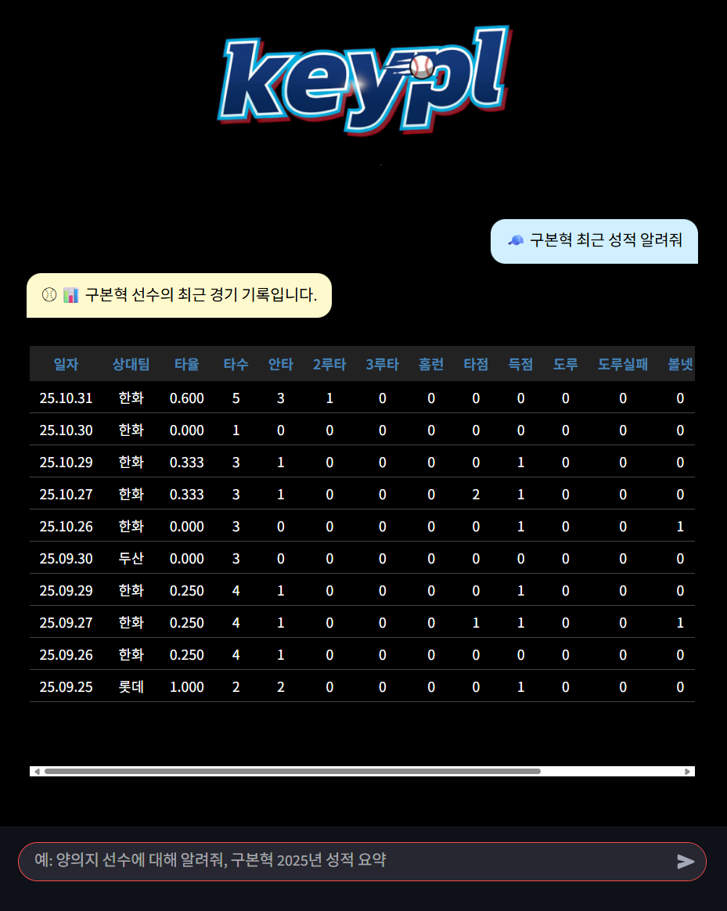
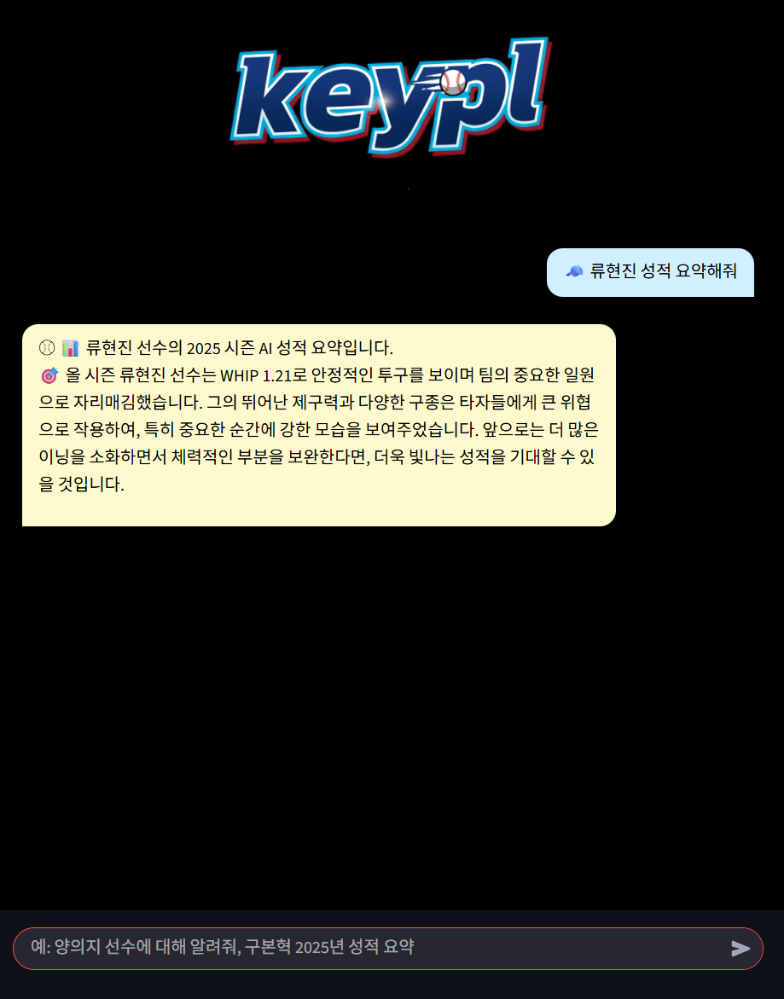
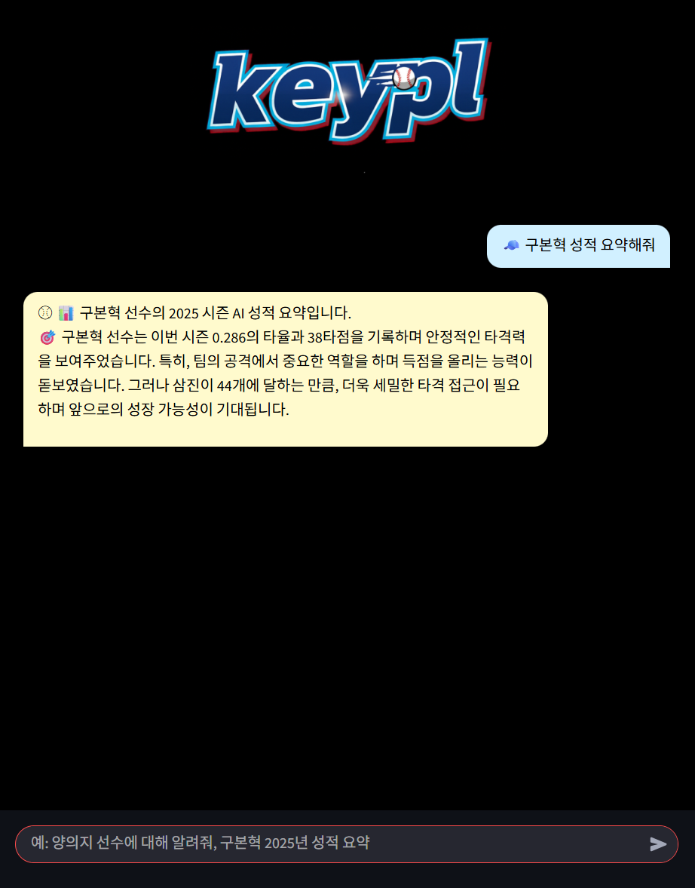
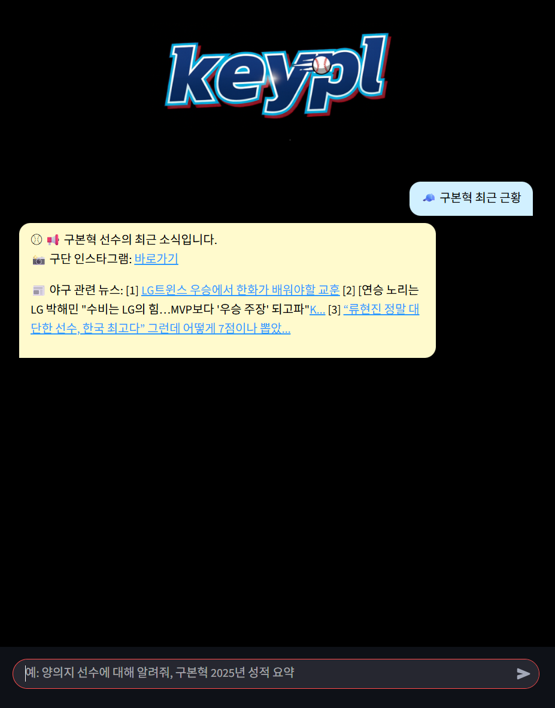
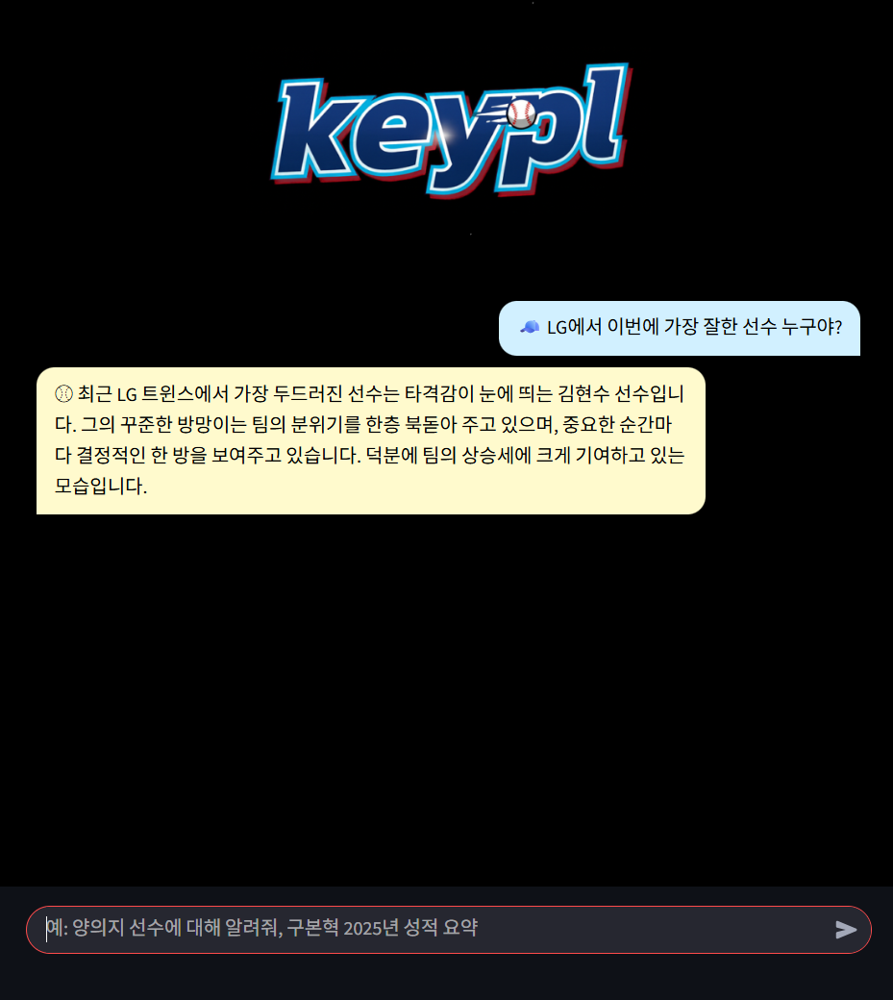
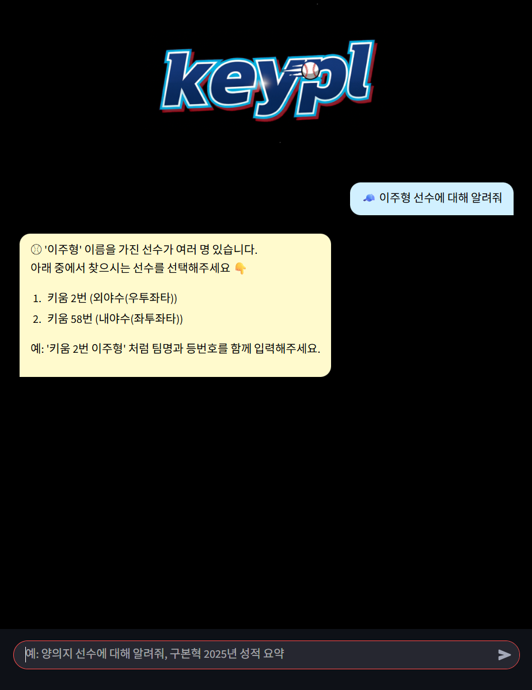
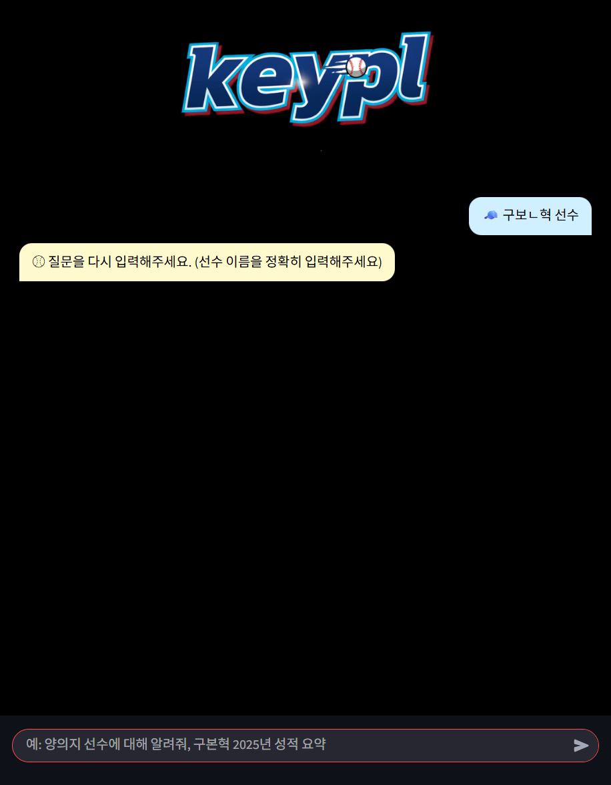

## 배포 관련 안내
본 프로젝트는 로컬 실행(Streamlit)을 기준으로 개발되었습니다.  
외부 배포 시 OpenAI 및 Naver API Key 보안 관리, Selenium 기반 크롤링 환경 설정이 필요하여  
포트폴리오 공개 저장소에는 실행 결과 영상과 코드 중심으로 정리했습니다.

## 프로젝트 구조
baseball-player-chatbot/
 ┣ src/
 ┃ ┗ chatbot_ui_chat.py        
 ┣ data/                       
 ┃ ┣ player_profiles_1.csv
 ┃ ┣ KBO_2025_player_stats_type.csv
 ┃ ┗ team_instagram_1.csv
 ┣ images/                     
 ┃ ┣ 1.png
 ┃ ┣ 2.png
 ┃ ┣ 3.png
 ┃ ┣ 4.png
 ┃ ┣ 5.png
 ┃ ┣ 6.png
 ┃ ┣ 7.png
 ┃ ┣ 8.png
 ┃ ┣ 9.png
 ┃ ┣ 10.png
 ┃ ┣ 11.png
 ┃ ┗ 12.png
 ┣ requirements.txt
 ┣ README.md
 ┗ 한국프로야구선수정보챗봇_최종.pdf

